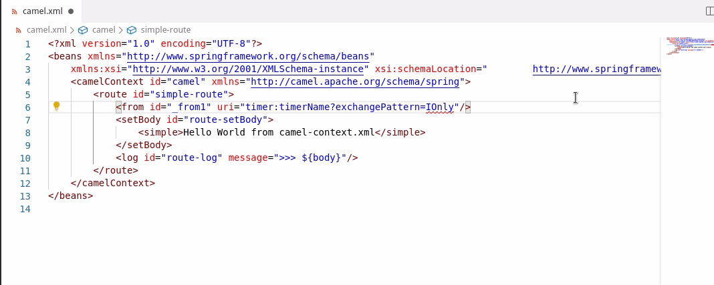

# Change Log

## 0.0.34

- Provide hover and type information for Kamelet properties based on embedded snapshot Kamelet catalog version
- Update Camel Kafka Connector Catalog version from 0.9.0 to 0.10.1
- Update default Camel Catalog version from 3.9.0 to 3.11.0
- Update Camel Quarkus Catalog from 1.8.1 to 2.0.0
- Adapt for Camel K community 1.5/Camel K Red Hat 1.4
  - Provide completion for new Camel K modeline option names
  - Provide completion for the different kinds of `config` and `resource` Camel K modeline options (`configmap`, `secret`, `file`) 
  - Provide quick action to convert from deprecated `property-file` to `property=file:` notation
  - Propose completion for `file:` notation on `property` Camel K modeline option
  - Provide local file system properties file path as completion after `property=file:`, `resource=file:` and `config=file:` Camel K modeline option
- Provide opt-in telemetry

## 0.0.33

- Provide completion and hover for Kamelet template id based on embedded snapshot Kamelet catalog version
- Provide completion for Kamelet property names based on embedded snapshot Kamelet catalog version

## 0.0.32

- Update default Camel Catalog from 3.8.0 to 3.9.0
- Update Camel Quarkus Catalog from 1.7.0 to 1.8.1
- Update Camel Kafka Connector Catalog from 0.8.0 to 0.9.0
- Propose Kafka topics in completion.
  - By default, they are retrieved from local Kafka instance at localhost:9092.
  - A setting allows to configure the Kafka connection URL. It can be found at **File -> Preferences -> Settings -> Apache Camel Tooling -> Kafka Connection URL**

## 0.0.31

- Update default Camel Catalog from 3.6.0 to 3.8.0
- Update Camel Kafka Connector Catalog from 0.7.0 to 0.8.0
- Provide Camel Quarkus Catalog 1.7.0
- Allow user to select a Runtime Provider in Settings which is adapting Camel Catalog to the specified runtime.

## 0.0.30

- Update default Camel Catalog from 3.6.0 to 3.7.0
- Update Camel Kafka Connector Catalog from 0.6.1 to 0.7.0
- Completion for `camel.(source|sink).(endpoint|path).*` inserts default value automatically
- Completion for [basic configuration](https://camel.apache.org/camel-kafka-connector/latest/basic-configuration.html) of Camel Kafka Connector
- Diagnostic in Camel Kafka Connector files:
  - for invalid `camel.(source|sink).(endpoint|path).*` property keys. A quickfix is provided as well for close property keys.
  - for mix of source and sink property keys
  - for mix of `camel.(source|sink).(endpoint|path).*` and `camel.(source|sink).url` usage
  - for duplicated keys differentiated by dash case or camel case
- Description based on `connector.class` value for completion and hover in Camel Kafka Connector files

## 0.0.29

- API based components support
  - Completion and hover documentation for properties
  - Completion for API name in Camel URI path parameter
  - Completion for method name of API in Camel URI path parameter
- Support Camel K modelines split across several lines
- Completion for jitpack in Camel K modeline dependency option
- Support Camel K modelines split across several lines
- Hover documentation on Camel URL inside Properties file (`camel.(sink|source).url`)

## 0.0.28

- Completion for `open-api` option in Camel K modeline filtered with JSON and YAML files
- Completion for resource-like options (`open-api`, `property-file` and `resource`) in Camel K modeline is hiding IDE configuration files (which are in `.vscode` folder)
- Include endpoints in outline for Camel XML files
- Document symbols for Camel routes written with Java DSL:
  - Outline. Note that if you select `sort by position`, you gain an overview of the route flow, not only of the element hierarchy.
  - Find symbol (`Ctrl+Shift+O`)
  - Breadcrumb
- Camel Kafka Connector support improvements:
  - Completion for `connector.class` property value based on Camel Kafka Connector Catalog.
  - Completion and hover for `camel.sink.*` and `camel.source.*` property keys based on Camel Kafka Connector Catalog.
  - Completion for `key.converter` and `value.converter` property values based on Camel Kafka Connector Catalog.
  - Completion for `transforms.*.type` property values based on Camel Kafka Connector Catalog.
  - Refactor action to convert from Camel URI `camel.(source|sink).url` to a list of properties.
- Update default Camel Catalog from 3.5.0 to 3.6.0

## 0.0.27

- Update default Camel Catalog from 3.4.1 to 3.5.0
- Completion for `property-file` and `resource` options in Camel K modeline
- Support dashed notation instead of camel cased in Properties file and Camel K modeline

## 0.0.26

- Fix regression introduced in 0.0.25 for missing completion for `component` group for camel.xxx properties
- Rely on Camel Catalog for list of groups for Camel properties completion
- Provide completion for properties of Camel property groups
- Update default Camel Catalog from 3.1.0 to 3.4.1

## 0.0.25

- First iteration of Camel K modeline support:
    - completion and hover for:
        - option names
        - trait definition names
        - trait property names
        - Camel artifact id for dependency
        - mvn dependency
        - Camel component properties
    - diagnostic for duplicated trait properties

- Use 'java.home' VS Code settings if provided to launch the Camel Language Server. Defaults to system path if not. (previously requiring java on system path)

## 0.0.24

- Diagnostic inside Camel Properties file
- Update default Camel Catalog from 3.1.0 to 3.3.0

## 0.0.23

- Quickfix for invalid enum values in Camel URIs filtered with relatively similar values

- Update default Camel Catalog from 3.0.1 to 3.1.0

## 0.0.22

- Add compatibility with VS Code Quarkus
- technical fix of JenkinsFile (to archive artifacts correctly when releasing)

## 0.0.21

- In Properties file, completion for possible enum values and booleans of a Camel component property
- In Properties file, the default values are automatically added when auto-completing Camel component properties
- In Properties file, provide filtered completion when in middle of a component id, component property or value. Previously, completion was available only right after the dot or equal separators.
- In Properties file, support insert-and-replace completion

## 0.0.20

- Diagnostic range for unknown properties is now at the exact property size instead of the full Camel URI

- Quickfix for unknown properties filtered with relatively similar values (to avoid having the whole list of potentially hundreds quickfixes)
- Diagnostic range for invalid enum values is now at the exact enum value size instead of the full Camel URI

- Preference to provide additional Camel components
- Improve diagnostic range when there are several parameters in XML DSL (restrict to the Camel URI instead of the full line)
- Update default Camel Catalog from 2.24.2 to 3.0.0 (as a reminder, it is possible to use the 2.x Catalog using preferences)
- Completion for all properties files for camel components ids with their properties

## 0.0.19

- Fix commenting of xml lines and blocks
- Preference to choose the version of the Camel Catalog used by the Language server

## 0.0.18

- Provide completion for Camel URIs on Camel-K Yaml files:
  - which are following one these conventions:
    - filename _*.camelk.yaml_
    - filename _*.yaml_ and starting with _// camel-k:_
  - Please note that all Camel components are provided in completion, specific Camel-K component are not filtered
- Update from Camel 2.24.1 to 2.24.2

## 0.0.17

- Update to naming approved by Red Hat legal

## 0.0.16

- Provide completion for Camel URIs on Camel-K Groovy files:
  - which are following one these conventions:
    - filename _*.camelk.groovy_
    - filename _*.groovy_ and starting with _// camel-k:_
    - filename _*.groovy_ and starting with _#!/usr/bin/env camel-k_ (not yet supported by Camel-K runtime see [here](https://github.com/apache/camel-k/issues/754))
  - Please note that all Camel components are provided in completion, specific Camel-K component are not filtered
- Provide completion for Camel URIs on Camel-K Kotlin files:
  - which are following one these conventions:
    - filename _*.camelk.kts_
    - filename _*.kts_ and starting with _// camel-k:_
  - Please note that all Camel components are provided in completion, specific Camel-K component are not filtered
- Provide completion for Camel URIs on Camel-K JS files:
  - which are following one these conventions:
    - filename _*.camelk.js_
    - filename _*.js_ and starting with _// camel-k:_
  - Please note that all Camel components are provided in completion, specific Camel-K component are not filtered
- Provide completion for Camel URI in Camel Kafka Connect properties file
  - properties file needs to use '=' without spaces notation
- Upgrade from Camel 2.24.0 to 2.24.1

## 0.0.15

- Report syntax error with validation
- Avoid false-positive validation for Camel components that can have additional parameters
- Upgrade from Camel 2.23.1 to 2.24.0

## 0.0.14

- Upgrade from Camel 2.23.0 to 2.23.1
- Improve Diagnostic handling to follow VS Code servers recommendations: clear Diagnostics on close

## 0.0.13

- Live-validation, no more need to save file to have validation
- "Find references" (Shift + F12) is now searching in all opened documents and not only in the current document
- Upgrade from Camel 2.22.1 to 2.23.0
- Generate log file of Camel Language Server in Java temporary folder instead of the opened folder

## 0.0.12

- Completion for referenced ids for direct, direct-vm, vm and seda components
- Fix incompatibility with Java Extension pack and Spring Boot Extension pack

## 0.0.11

- Fix regression of missing completion for empty uris and missing default values

## 0.0.10

- Find references for direct and direct-vm component (Shift + F12)
- Depending on hovered part of the Camel URI, hover now provides documentation for Camel Component or Camel attributes
- Completion now insert-and-replace the component/attribute when completion triggered in middle of the element

## 0.0.9

- support navigation on Camel context with XML DSL (Ctrl+Shift+O and outline)
- support single quote notation for XML attributes
- support completion on global endpoint with XML DSL

## 0.0.8

- support diagnostic for Camel URI with XML DSL (updated on save)

## 0.0.7

- support Camel URI completion and hover in Java DSL for Camel files

## 0.0.3

- support Camel URI completion with XML DSL
- support hover documentation on Camel URI with XML DSL
- support navigation on routes with XML DSL (Ctrl+Shift+O)
