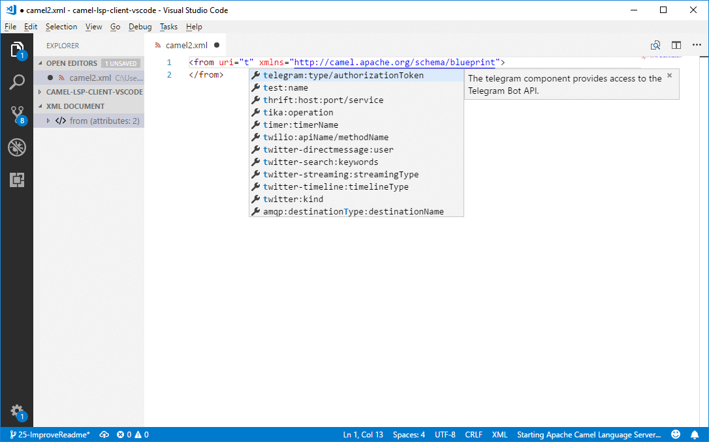
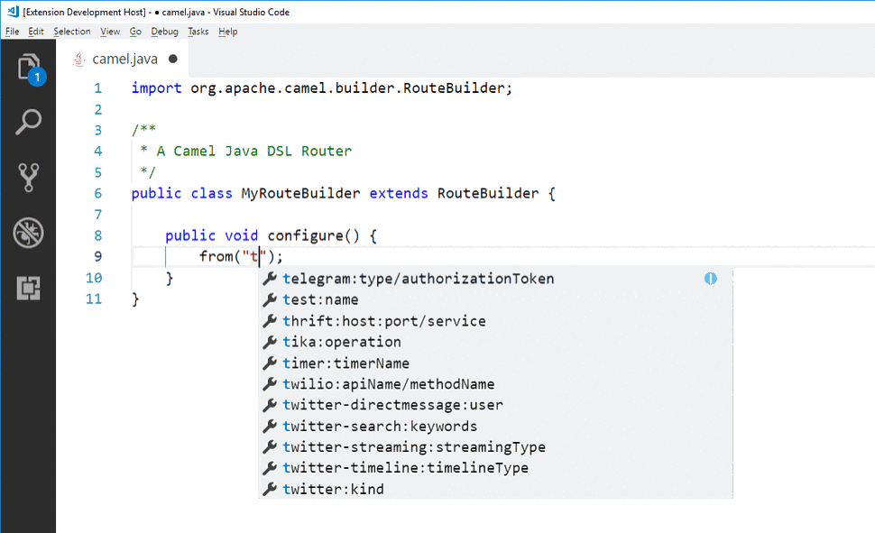
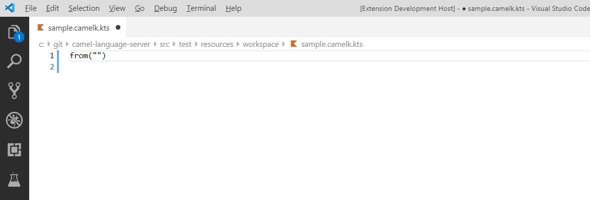
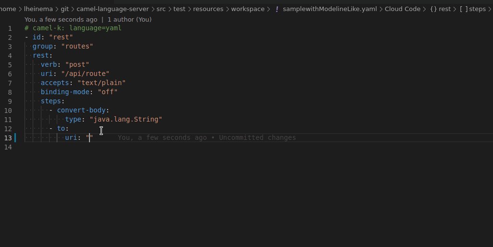
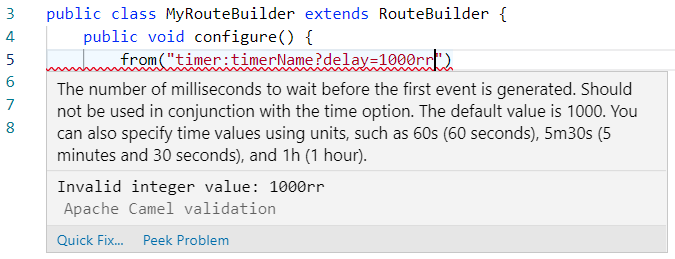
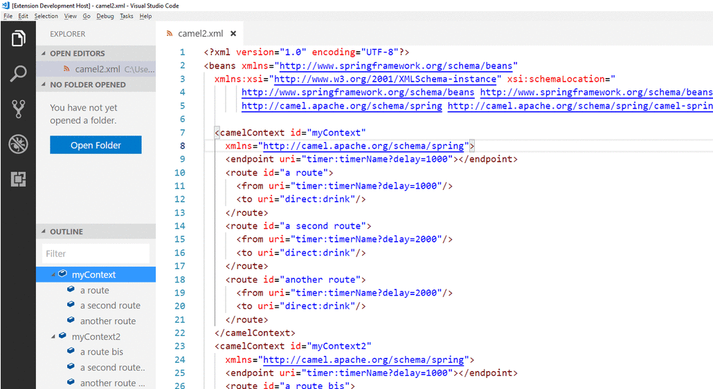
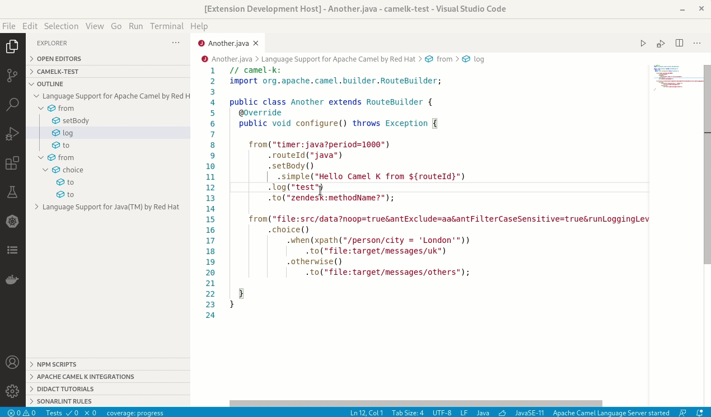
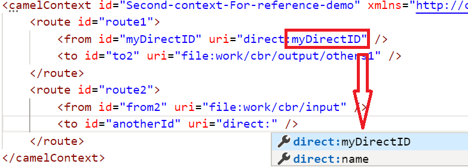

[]()
[](https://circleci.com/gh/camel-tooling/camel-lsp-client-vscode)
[]()
[](https://gitter.im/camel-tooling/Lobby)

# Apache Camel for Visual Studio Code

This is a preview release of the [Visual Studio Code](https://code.visualstudio.com/) extension that adds [Apache Camel](http://camel.apache.org/) language support for XML DSL and Java DSL code.

When you add this extension to your installation of VS Code, the VS Code editor provides the following features:

* Language service support for Apache Camel URIs (both XML DSL and Java DSL)

   * Auto-completion for Camel components, attributes, and the list of attribute values

     XML DSL

     

     Java DSL

     

	 Camel-K Groovy DSL (It requires to have file named with the pattern _*.camelk.groovy_ or that the file starts with _// camel-k:_)

     

     Camel-K Kotlin DSL (It requires to have file named with the pattern _*.camelk.kts or that the file starts with _// camel-k:_)

     

	 Camel-K JavaScript DSL (It requires to have file named with the pattern _*.camelk.js or that the file starts with _// camel-k:_)

     

	 Camel Kafka Connect properties

	 

	 Camel-K Yaml DSL (It requires to have file named with the pattern _*.camelk.yaml_ or that the file starts with _// camel-k:_)

     

     Camel properties file (restricted to camel components ids and camel components properties)

     

   * Quick reference documentation when you hover the cursor over a Camel component

    

* Diagnostics for Camel URIs

    
    

* Navigation to Camel contexts and routes in the VS Code outline panel and in the **Go > Go to Symbol in File** navigation panel (XML DSL only)

  

* Navigation for Java and XML DSL
    * Outline. Note that if you select `sort by position`, you gain an overview of the route flow, not only of the element hierarchy.
    * Find symbol (`Ctrl+Shift+O`)
    * Breadcrumb

  

* Auto-completion for referenced IDs of `direct`, `direct VM`, `VM` and `SEDA` components (XML DSL only)

  

* Find references for `direct` and `direct VM` components in all open Camel files (XML DSL only)

  

* Camel K modelines support
  * completion and hover for:
    * option names
    * trait definition names
    * trait property names
    * Camel artifact id for dependency
    * mvn dependency
    * Camel properties
  * diagnostic for duplicated trait properties

  

* Camel Kafka Connector support:
  * Completion and hover for Camel URIs as property values of `camel.sink.url` and `camel.source.url`
  * Completion and hover for `connector.class` property value based on Camel Kafka Connector Catalog.
  * Completion and hover for `camel.sink.*` and `camel.source.*` property keys based on Camel Kafka Connector Catalog.
  * Completion for `key.converter` and `value.converter` property values based on Camel Kafka Connector Catalog.
  * Completion for `transforms.*.type` property values based on Camel Kafka Connector Catalog.
  * Completion for [basic configuration|https://camel.apache.org/camel-kafka-connector/latest/basic-configuration.html]
  * Diagnostic in Camel Kafka Connector files:
    * for invalid `camel.(source|sink).(endpoint|path).*` property keys. A quickfix is provided as well for close property keys.
    * for mix of source and sink property keys
    * for mix of `camel.(source|sink).(endpoint|path).*` and `camel.(source|sink).url` usage
    * for duplicated keys differentiated by dash case or camel case

It is possible to use a specific Camel Catalog version. This can be specified in **File -> Preferences -> Settings -> Apache Camel Tooling -> Camel catalog version**

To use a Red Hat integration productized version, you need to configure extra repositories. See in [Camel Language Server documentation](https://github.com/camel-tooling/camel-language-server/blob/master/README.md#specific-version-of-camel-catalog).

It is possible to use a specific Runtime provider for the Camel catalog. This can be specified in **File -> Preferences -> Settings -> Apache Camel Tooling -> Camel catalog runtime provider**

Additional Camel components can be provided. This can be specified in **File -> Preferences -> Settings -> Apache Camel Tooling -> Extra-components -> Edit in settings.json**
You can add a list of Camel components definition. This json definition can be found in jar of the Camel component. You will end up with something like:
```
{
	"camel.extra-components": [{
		"component": {
			...
		},
		"componentProperties": {
			...
		},
		"properties": {
			...
		}
	}]
}
```

It is possible to use dashed notation in properties file and Camel K modelines. By default, the completion is using the camel cased notation. It is using the dashed notation when there is another Camel property already using dashed notation in the same file.

For detailed information about Apache Camel supported features, see the [Language Server GitHub page](https://github.com/camel-tooling/camel-language-server#features).

## Contact Us
If you run into an issue or have a suggestion, you can report it by [creating a new issue on GitHub](https://github.com/camel-tooling/camel-lsp-client-vscode/issues).

## How to install
You can download this **Language Support for Apache Camel** extension from the Visual Studio Code Marketplace at https://marketplace.visualstudio.com/items?itemName=camel-tooling.vscode-apache-camel.

After you install VS Code, follow these steps:
1. In VS Code, select **View > Extensions**.
2. Search for **Camel**.
3. Select the **Language Support for Apache Camel** option and then click *Install*.

## Requirements for using this extension

After you install this **Language Support for Apache Camel** extension, follow these guidelines to access its features:

For an XML DSL file:
* Use an `.xml` file extension.
* Specify the Camel namespace http://camel.apache.org/schema/blueprint or http://camel.apache.org/schema/spring.

For a Java DSL file:
* Use a `.java` file extension.
* Specify Camel (usually from an imported package).
  For example: `import org.apache.camel.builder.RouteBuilder`
* To reference the Camel component, use `from` or `to` and a string without a space. The string cannot be a variable. For example, `from("timer:timerName")` works but `from( "timer:timerName")` and `from(aVariable)` do not work.

## Data and Telemetry

The VS Code Language support for Apache Camel extension collects anonymous [usage data](USAGE_DATA.md) and sends it to Red Hat servers to help improve our products and services. Read our [privacy statement](https://developers.redhat.com/article/tool-data-collection) to learn more. This extension respects the `redhat.elemetry.enabled` setting which you can learn more about at https://github.com/redhat-developer/vscode-redhat-telemetry#how-to-disable-telemetry-reporting
