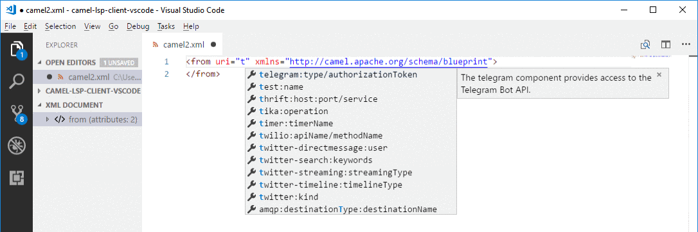

<h1 align="center">
  
   
  Language Support for Apache Camel
</h1>

  
  
  
  

 

<h2 align="center">LSP Client for Visual Studio Code.</h2>

  <a href="#features">Features</a> •
  <a href="#requirements">Requirements</a> •
  <a href="https://camel-tooling.github.io/camel-lsp-client-vscode/">Documentation</a> •
  <a href="#issues">Issues</a>  •
  <a href="#data-and-telemetry">Telemetry</a>

This is the <a href="https://code.visualstudio.com/">Visual Studio Code</a> extension that adds language support for <a href="http://camel.apache.org/">Apache Camel</a> for XML, Java and Yaml DSL code.

 

### Features

- Language service support for Apache Camel URIs.
- Quick reference documentation when you hover the cursor over a Camel component.
- Diagnostics for Camel URIs.
- Navigation for Java and XML.
- Camel K modelines support.
- Use a specific Camel Catalog version.
- Use a specific Runtime provider for the Camel catalog.
- Additional Camel components can be provided.
- Use dashed notation in properties file and Camel K modelines.
- Create a Camel Route using Camel JBang.
  - YAML DSL
  - Java DSL
  - XML DSL
  - from an OpenAPI file using YAML DSL
  - Kamelet with YAML DSL
  - Custom Resource Pipe with YAML DSL
- Transform Camel Routes from XML, Yaml or Java to YAML or XML io using Camel JBang.
- Create a Camel Quarkus project
- Create a Camel on SpringBoot project
- **XML DSL Only:**
  - Find references for `direct` and `direct VM` components in all open Camel files.
  - Navigation to Camel contexts and routes in the VS Code outline panel and in the **Go > Go to Symbol in Editor...** navigation panel.
  - Auto-completion for referenced IDs of `direct`, `direct VM`, `VM` and `SEDA` components.
- Completion in pom.xml
  - Completion for Camel component Maven dependency in pom.xml. Take care to have the correct runtime provider selected in Preferences.
  - Completion to add Camel Quarkus debug profile

For detailed information about Apache Camel supported features, see the [Apache Camel Language Server](https://github.com/camel-tooling/camel-language-server#features).

### Requirements

**Java 17+** is currently required to launch the [Apache Camel Language Server](https://github.com/camel-tooling/camel-language-server). The `camel.ls.java.home` VS Code preferences can be used to use a different version of JDK than the default one installed on the machine.

⚠️ For some features, [JBang](https://www.jbang.dev/documentation/guide/latest/index.html) must be available on a system command-line.

For an **XML DSL** files:

- Use an `.xml` file extension.
- Specify the Camel namespace `http://camel.apache.org/schema/blueprint` or `http://camel.apache.org/schema/spring`

For a **Java DSL** files:

- Use a `.java` file extension.
- Specify Camel (usually from an imported package).
  For example: `import org.apache.camel.builder.RouteBuilder`.
- To reference the Camel component, use `from` or `to` and a string without a space. The string cannot be a variable. For example, `from("timer:timerName")` works, but `from( "timer:timerName")` and `from(aVariable)` do not work.

### Documentation

Our full documentation is located in [GitHub pages](https://camel-tooling.github.io/camel-lsp-client-vscode/). Included are details about all of LSP Client for Visual Studio Code capabilities with examples and detailed information.

### Issues

Something is not working properly? In that case, feel free to [open issues, add feature requests, report bugs, etc.](https://github.com/camel-tooling/camel-lsp-client-vscode/issues)

### Get Involved

If you'd like to help us get better, we appreciate it!
Check out our [Contribution Guide](Contributing.md) on how to do that.

### Data and Telemetry

The LSP Client for Visual Studio Code extension collects anonymous [usage data](USAGE_DATA.md) and sends it to Red Hat servers to help improve our products and services. Read our [privacy statement](https://developers.redhat.com/article/tool-data-collection) to learn more. This extension respects the `redhat.elemetry.enabled` setting which you can learn more about at [How to disable Telemetry reporting](https://github.com/redhat-developer/vscode-redhat-telemetry#how-to-disable-telemetry-reporting).
