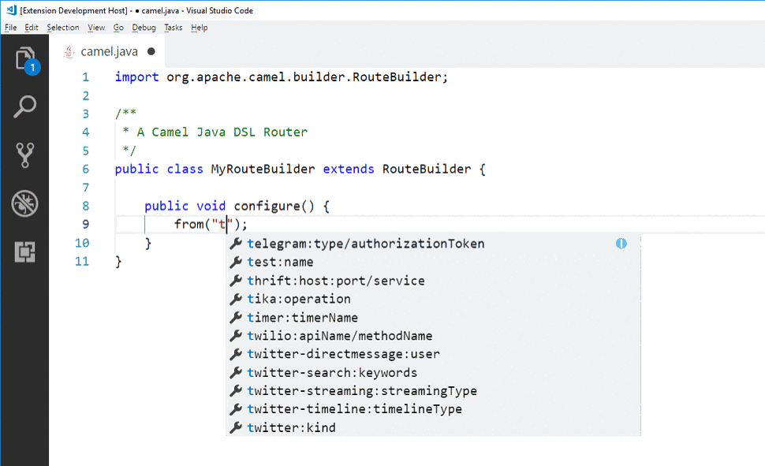
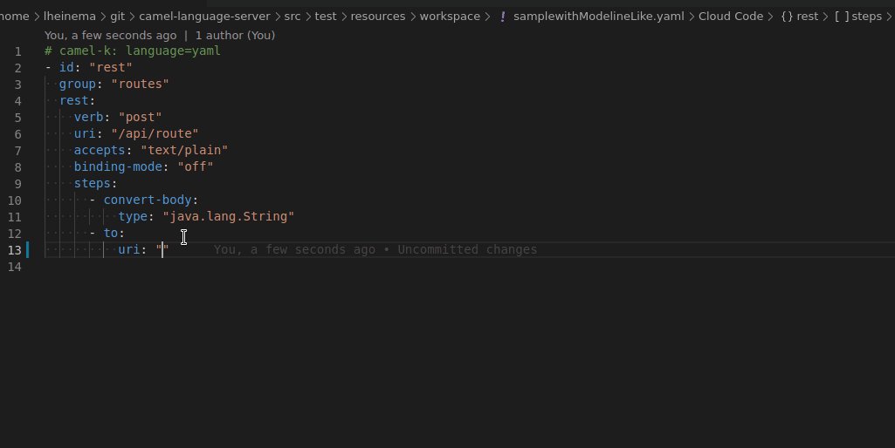
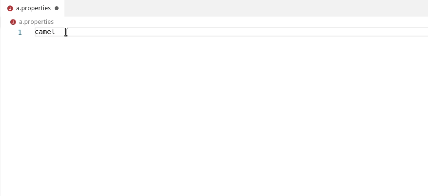

## Language service support for Apache Camel URIs

This feature is supported in both – XML DSL and Java DSL. Auto-completion for Camel components, attributes, and the list of attribute values

**XML DSL**

**Java DSL**

**Camel K YAML DSL**

- It requires to having a file named with the pattern _*.camelk.yaml_ or that the file starts with `// camel-k:`

**Camel properties file**

- Restricted to camel components ids and camel components properties

