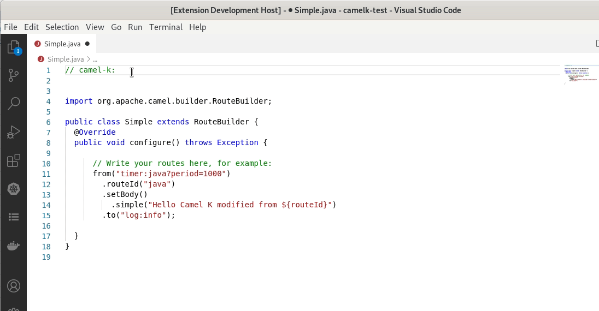

## Camel K modelines support

- completion and hover for:
  - option names
  - trait definition names
  - trait property names
  - Camel artifact id for dependency
  - mvn dependency
  - Camel properties
  - diagnostic for duplicated trait properties

**Note**: By default, the completion is using the Camel cased notation. But It is possible to use dashed notation in the properties file and Camel K modelines. It is using the dashed notation when there is another Camel property already using the dashed notation in the same file.
