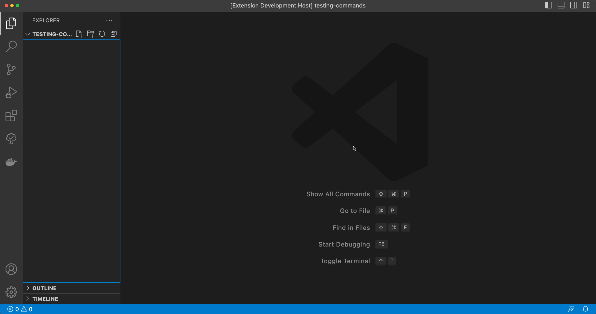
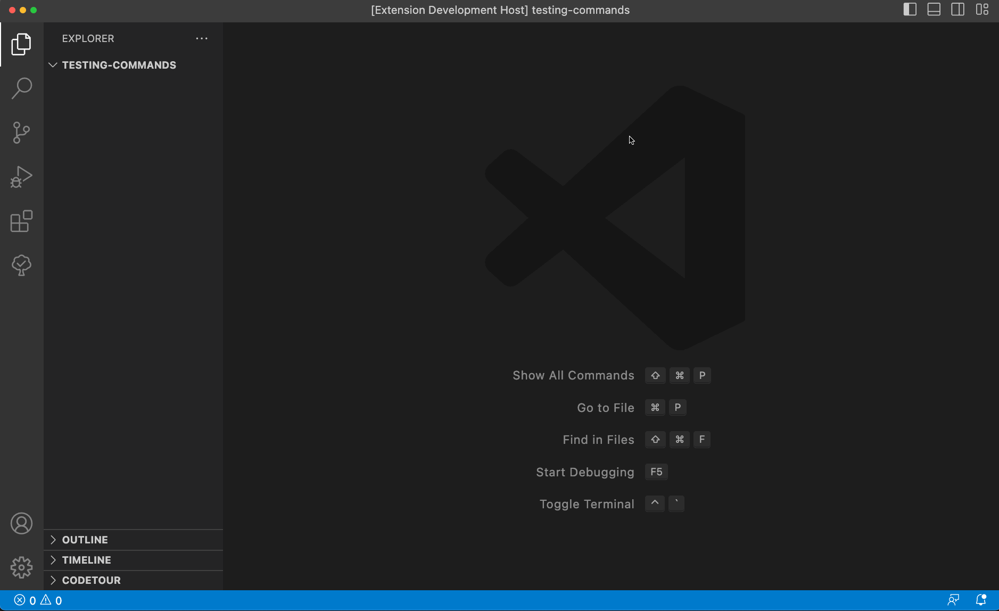

# Create a Camel Route using Camel JBang

- The [JBang](https://www.jbang.dev/documentation/guide/latest/index.html) must be available on a system command-line.

## Yaml DSL

## Java DSL

## XML DSL

