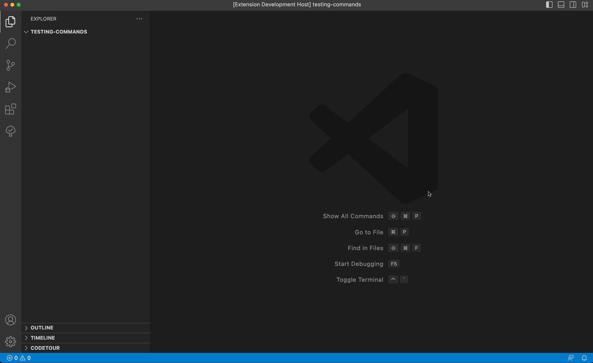
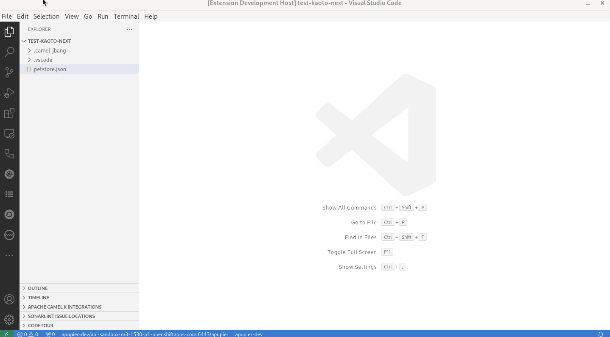

# Create a Camel Route using Camel JBang

- The [JBang](https://www.jbang.dev/documentation/guide/latest/index.html) cli must be available on a system command-line.

## YAML DSL

## Java DSL

## XML DSL

## From an OpenAPI file with YAML Dsl

# Create a Camel project (using Camel JBang export)

- The [JBang](https://www.jbang.dev/documentation/guide/latest/index.html) cli must be available on a system command-line.

## Quarkus

It is asking for the Maven GAV (group id, artifact id, version) to be used to generate the project.

In case there are Camel files in the workspace, it is copying them in `src/main/resources/camel` folder of the created Camel Quarkus based project.

## SpringBoot

It is asking for the Maven GAV (group id, artifact id, version) to be used to generate the project.

In case there are Camel files in the workspace, it is copying them in `src/main/resources/camel` folder of the created Camel Quarkus based project.

