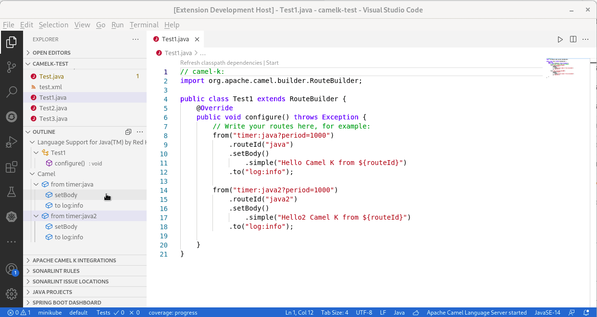
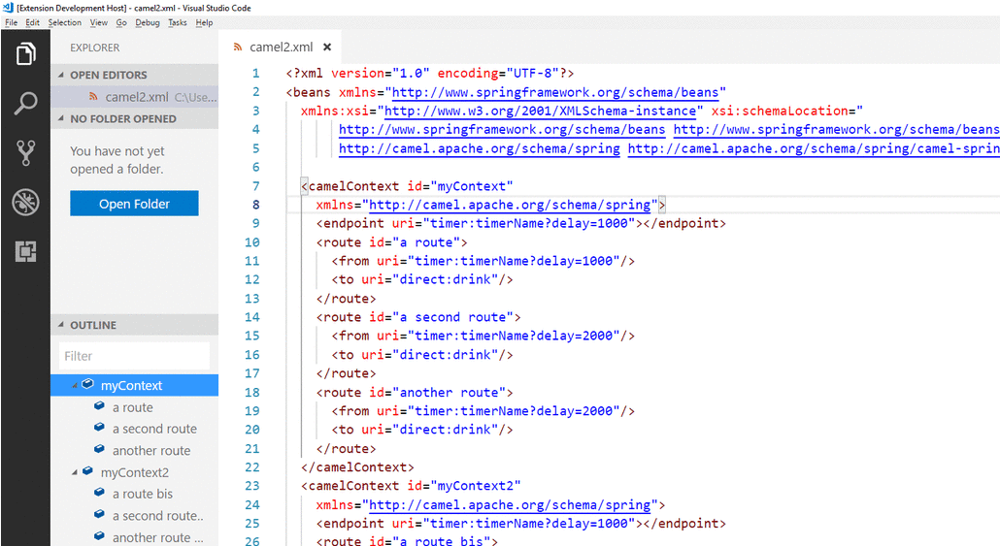

## Navigation for Java and XML DSL

- Navigation to Camel contexts and routes in the VS Code outline panel and in the **Go > Go to Symbol in Editor...** navigation panel
- Outline. Note that if you select `sort by position`, you gain an overview of the route flow, not only of the element hierarchy.

**Java DSL**

**XML DSL**

