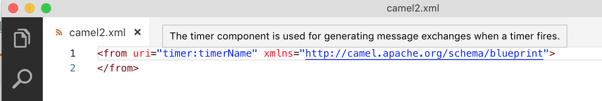

## Specific Camel Catalog Version

It is possible to use a specific Camel Catalog version. This can be specified in `File > Preferences > Settings > Apache Camel Tooling > Camel catalog version`

Please note that the first time a version is used, it can take several seconds/minutes to have it available depending on the time to download the dependencies in the background.

When using a Red Hat productized version that contains `redhat` in its version identifier, the Maven Red Hat repository is automatically added.

To use other versions not available on Maven Central, you need to configure extra repositories. See in [Camel Language Server documentation](https://github.com/camel-tooling/camel-language-server/blob/main/README.md#specific-version-of-camel-catalog).

## Specific Runtime provider for the Camel Catalog

It is possible to use a specific Runtime provider for the Camel catalog. This can be specified in `File > Preferences > Settings > Apache Camel Tooling > Camel catalog runtime provider`

## Provide Additional Camel components

Additional Camel components can be provided. This can be specified in `File > Preferences > Settings > Apache Camel Tooling > Extra-components > Edit in settings.json`

You can add a list of Camel components definition. This json definition can be found in jar of the Camel component. You will end up with something like:

```json
{
   "camel.extra-components": [{
      "component": {
        ...
      },
      "componentProperties": {
        ...
      },
      "properties": {
        ...
      }
   }]
}
```

**Note**: By default, the completion is using the Camel cased notation. But It is possible to use dashed notation in the properties file and Camel K modelines. It is using the dashed notation when there is another Camel property already using the dashed notation in the same file.

## Quick Reference Documentation

Quick reference documentation when you hover the cursor over a Camel component.

<p align="center"></p>
