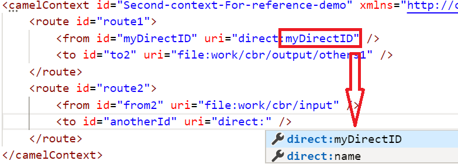
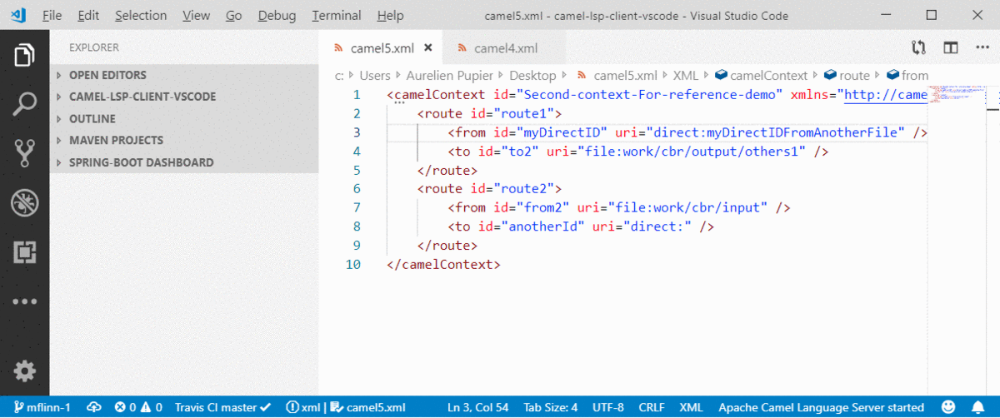

## XML DSL only supported features

- Auto-completion for referenced IDs of `direct`, `direct VM`, `VM` and `SEDA` components

- Find references for `direct` and `direct VM` components in all open Camel files

